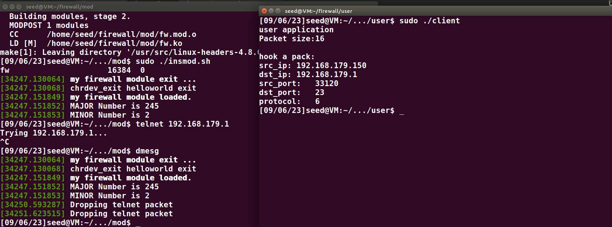

# firewall

## target_1

demo:注册netfilter hook函数，注册字符设备,user打印出报文信息

### netfilter

```c
Hook:
NF_INET_PRE_ROUTING
NF_INET_LOCAL_IN
NF_INET_FORWARD
NF_INET_LOCAL_OUT
NF_INET_POST_ROUTING

RETURN:
NF_DROP
NF_ACCEPT
NF_STOLEN
NF_QUEUE
NF_REPEAT
```

**sk_buff**
skb指针指向sk_buff数据结构，网络堆栈用sk_buff数据结构来描述数据包。这个数据结构在linux/skbuff.h中定义。sk_buff数据结构中最有用的部分就是那三个描述传输层包头、网络层包头以及链路层包头的联合(union)了。这三个联合的名字分别是h、nh以及mac

[ip tcp ..结构体](https://www.cnblogs.com/songshuaiStudy/p/11496065.html)

```c
//define    struct    memcpy   copy_to_user	五元组
struct iphdr *ip = ip_hdr(skb);
	pkg.src_ip = ip->saddr;
	pkg.dst_ip = ip->daddr;
    ip->protocol == TCP
struct tcphdr *tcp = tcp_hdr(skb);
    pkg.src_port = ntohs(tcp->source);
    pkg.dst_port = ntohs(tcp->dest);
    if ((tcp->syn) && (!tcp->ack))
        syn = 1;
    else
        syn = 0;
```


### 字符设备驱动

https://zhuanlan.zhihu.com/p/506834783

https://zhuanlan.zhihu.com/p/580525141
[字符设备驱动](https://blog.csdn.net/weixin_42314225/article/details/81112217)
https://blog.csdn.net/zqixiao_09/article/details/50858946   /***/


open release close

write read
copy_to_user//copy_from_user//***

ioctl

写入规则
发起查询

mknod /dev/chardev_test c 245 2
#驱动加载成功后需要在/dev目录下创建一个与之对应的设备节点文件，应用程序就是通过操作这个设备文件来完成对具体设备的操作。
卸载模块后依然存在，模块插入后，devid不变正常使用？？




## target: 数据

### 日志

子线程 每分钟从内核读取
内核大数组  overflow循环
日志库？？
```c
typedef struct
{
    uint32_t src_ip;
    uint32_t dst_ip;
    uint16_t src_port;
    uint16_t dst_port;
    uint8_t protocol;
    bool action;
    bool is_log
} Rule;
typedef struct
{
    time;
    uint32_t src_ip;
    uint32_t dst_ip;
    uint16_t src_port;
    uint16_t dst_port;
    uint8_t protocol;
}Log
```
LOG:
[time]...

## target:状态检测表

todo

## other

```shell
dmesg -C
rmmod fw
insmod fw.ko
lsmod | grep "fw"
dmesg

ls /dev | grep char
mknod /dev/chardev_test c 245 2
rm -f /dev/chardev_test

cat /proc/devices  | grep char
```


firewall open
firewall close
default accept
default drop
add rule
remove rule
modify rule
ls rule
commit rule
connection
exit

NAT....

sudo docker start HostV
sudo docker exec -it HostV /bin/bash
sudo docker start HostV2V
sudo docker exec -it HostV2V /bin/bash

TCP:
nc -l port
nc ip port
UDP
nc -ul port
nc -u ip port


nc -l port
nc -l port >file
nc -ul port


nc ip port < file

nc -l 9999 > fwep
nc 192.168.60.101 9999 < client

nc -vzw 2 192.168.60.101 9999
nc -vuz 192.168.60.101 9998


[linux驱动18：信号量（内核）](https://blog.csdn.net/dongyoubin/article/details/124566492)

内核使用信号量包含<linux/semaphore.h>，相关的类型为struct semaphore。
https://blog.csdn.net/u010835747/article/details/120066165

hash:
//https://blog.csdn.net/desireknowledge_/article/details/132394473
//https://git.nju.edu.cn/nju/linux/-/blob/v6.0-rc4/include/linux/crc16.h
//https://www.coder.work/article/169576

system(command)

https://blog.csdn.net/zhaogang1993/article/details/79502067
https://blog.csdn.net/weixin_42915431/article/details/122187058

[dmesg命令简介](https://blog.csdn.net/guotianqing/article/details/108401743)

sudo ./client
perror("open");


dev_t devid;//函数向内核申请下来的设备号
struct cdev cdev;//内核中使用cdev结构体来描述字符设备，在驱动中分配cdev,主要是分配一个cdev结构体与申请设备号
cdev_init(&cdev, &chardev_fops);//执行cdev_init函数，将cdev和file_operations关联起来
alloc_chrdev_region(&devid, 2, 255, MYNAME);//向内核申请主设备号
cdev_add(&cdev, devid, 255);//执行cdev_init函数，将cdev和file_operations关联起来
struct file_operations hello_fops = {
	.owner = THIS_MODULE,
	.open = hello_open,
	.release = hello_release,
	.read = hello_read,
	.write = hello_write,
};
mknod /dev/chardev_test c 245 2
#驱动加载成功后需要在/dev目录下创建一个与之对应的设备节点文件，应用程序就是通过操作这个设备文件来完成对具体设备的操作。


/*
#define MAX_SIZE 1024
static int my_open(struct inode *inode, struct file *file);
static int my_release(struct inode *inode, struct file *file);
static ssize_t my_read(struct file *file, char __user *user, size_t t, loff_t *f);
static ssize_t my_write(struct file *file, const char __user *user, size_t t, lof f_t *f);
static char message[MAX_SIZE] = "-------congratulations--------!";
static int device_num = 0;         //设备号
static int counter = 0;            //计数用
static int mutex = 0;              //互斥用
static char *devName = "myDevice"; //设备名
struct file_operations pStruct =
    {
        open : my_open,
        release : my_release,
        read : my_read,
        write : my_write,
    };
*/

/* Standard well-defined IP protocols.  */
enum {

  IPPROTO_IP = 0,		/* Dummy protocol for TCP		*/
#define IPPROTO_IP		IPPROTO_IP

  IPPROTO_ICMP = 1,		/* Internet Control Message Protocol	*/
#define IPPROTO_ICMP		IPPROTO_ICMP

  IPPROTO_TCP = 6,		/* Transmission Control Protocol	*/
#define IPPROTO_TCP		IPPROTO_TCP

  IPPROTO_UDP = 17,		/* User Datagram Protocol		*/
#define IPPROTO_UDP		IPPROTO_UDP

  IPPROTO_RAW = 255,		/* Raw IP packets			*/
#define IPPROTO_RAW		IPPROTO_RAW
  IPPROTO_MAX
};


头文件中申明，用extern,在cpp中定义,头文件只能申明全局变量（extern），不可定义如果在.cpp里使用static定义，则该变量只在当前cpp文件中有效，在别的文件中无效
在.h里使用static定义，不会进行编译（.h文件不编译），只会在其每个include的cpp文件中包含编译，相当于在.cpp里使用static定义。

jiaohu

python
Python 2.7.12 (default, Nov 19 2016, 06:48:10) 
[GCC 5.4.0 20160609] on linux2
Type "help", "copyright", "credits" or "license" for more information.
>>> 
