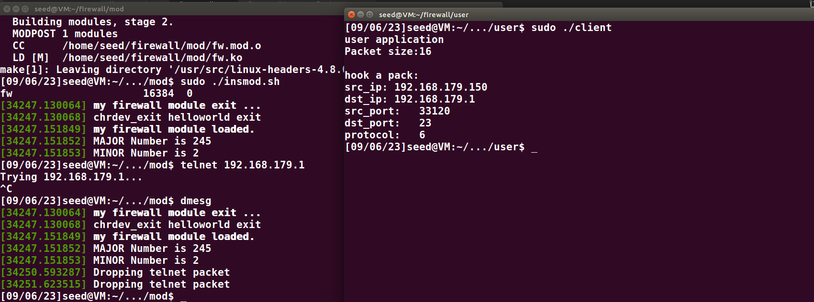

## target_1

demo:注册netfilter hook函数，注册字符设备,user打印出报文信息

### netfilter

```c
Hook:
NF_INET_PRE_ROUTING
NF_INET_LOCAL_IN
NF_INET_FORWARD
NF_INET_LOCAL_OUT
NF_INET_POST_ROUTING

RETURN:
NF_DROP
NF_ACCEPT
NF_STOLEN
NF_QUEUE
NF_REPEAT
```

**sk_buff**
skb指针指向sk_buff数据结构，网络堆栈用sk_buff数据结构来描述数据包。这个数据结构在linux/skbuff.h中定义。sk_buff数据结构中最有用的部分就是那三个描述传输层包头、网络层包头以及链路层包头的联合(union)了。这三个联合的名字分别是h、nh以及mac

```c
//define    struct    memcpy   copy_to_user	五元组
struct iphdr *ip = ip_hdr(skb);
	pkg.src_ip = ip->saddr;
	pkg.dst_ip = ip->daddr;
    ip->protocol == TCP
struct tcphdr *tcp = tcp_hdr(skb);
    pkg.src_port = ntohs(tcp->source);
    pkg.dst_port = ntohs(tcp->dest);
    if ((tcp->syn) && (!tcp->ack))
        syn = 1;
    else
        syn = 0;
```


### 字符设备驱动

https://zhuanlan.zhihu.com/p/506834783

https://zhuanlan.zhihu.com/p/580525141
[字符设备驱动](https://blog.csdn.net/weixin_42314225/article/details/81112217)
https://blog.csdn.net/zqixiao_09/article/details/50858946   /***/


open release close

write read
copy_to_user//copy_from_user//***

ioctl

写入规则
发起查询

mknod /dev/chardev_test c 245 2
#驱动加载成功后需要在/dev目录下创建一个与之对应的设备节点文件，应用程序就是通过操作这个设备文件来完成对具体设备的操作。
卸载模块后依然存在，模块插入后，devid不变正常使用？？




## target: 数据

### 日志

子线程 每分钟从内核读取
内核大数组  overflow循环
日志库？？
```c
typedef struct
{
    uint32_t src_ip;
    uint32_t dst_ip;
    uint16_t src_port;
    uint16_t dst_port;
    uint8_t protocol;
    bool action;
    bool is_log
} Rule;
typedef struct
{
    time;
    uint32_t src_ip;
    uint32_t dst_ip;
    uint16_t src_port;
    uint16_t dst_port;
    uint8_t protocol;
}Log
```
LOG:
[time]...

## target:状态检测表

todo

## other

```shell
dmesg -C
rmmod fw
insmod fw.ko
lsmod | grep "fw"
dmesg
mknod /dev/chardev_test c 245 2
cat /proc/devices
```

close’ was not declared in this scope??
内核中不能使用C库提供的函数??
权限


system(command)

https://blog.csdn.net/zhaogang1993/article/details/79502067
https://blog.csdn.net/weixin_42915431/article/details/122187058

[dmesg命令简介](https://blog.csdn.net/guotianqing/article/details/108401743)

sudo ./client
perror("open");


dev_t devid;//函数向内核申请下来的设备号
struct cdev cdev;//内核中使用cdev结构体来描述字符设备，在驱动中分配cdev,主要是分配一个cdev结构体与申请设备号
cdev_init(&cdev, &chardev_fops);//执行cdev_init函数，将cdev和file_operations关联起来
alloc_chrdev_region(&devid, 2, 255, MYNAME);//向内核申请主设备号
cdev_add(&cdev, devid, 255);//执行cdev_init函数，将cdev和file_operations关联起来
struct file_operations hello_fops = {
	.owner = THIS_MODULE,
	.open = hello_open,
	.release = hello_release,
	.read = hello_read,
	.write = hello_write,
};
mknod /dev/chardev_test c 245 2
#驱动加载成功后需要在/dev目录下创建一个与之对应的设备节点文件，应用程序就是通过操作这个设备文件来完成对具体设备的操作。


/*
#define MAX_SIZE 1024
static int my_open(struct inode *inode, struct file *file);
static int my_release(struct inode *inode, struct file *file);
static ssize_t my_read(struct file *file, char __user *user, size_t t, loff_t *f);
static ssize_t my_write(struct file *file, const char __user *user, size_t t, lof f_t *f);
static char message[MAX_SIZE] = "-------congratulations--------!";
static int device_num = 0;         //设备号
static int counter = 0;            //计数用
static int mutex = 0;              //互斥用
static char *devName = "myDevice"; //设备名
struct file_operations pStruct =
    {
        open : my_open,
        release : my_release,
        read : my_read,
        write : my_write,
    };
*/

/* Standard well-defined IP protocols.  */
enum {
  IPPROTO_IP = 0,		/* Dummy protocol for TCP		*/
#define IPPROTO_IP		IPPROTO_IP
  IPPROTO_ICMP = 1,		/* Internet Control Message Protocol	*/
#define IPPROTO_ICMP		IPPROTO_ICMP
  IPPROTO_IGMP = 2,		/* Internet Group Management Protocol	*/
#define IPPROTO_IGMP		IPPROTO_IGMP
  IPPROTO_IPIP = 4,		/* IPIP tunnels (older KA9Q tunnels use 94) */
#define IPPROTO_IPIP		IPPROTO_IPIP
  IPPROTO_TCP = 6,		/* Transmission Control Protocol	*/
#define IPPROTO_TCP		IPPROTO_TCP
  IPPROTO_EGP = 8,		/* Exterior Gateway Protocol		*/
#define IPPROTO_EGP		IPPROTO_EGP
  IPPROTO_PUP = 12,		/* PUP protocol				*/
#define IPPROTO_PUP		IPPROTO_PUP
  IPPROTO_UDP = 17,		/* User Datagram Protocol		*/
#define IPPROTO_UDP		IPPROTO_UDP
  IPPROTO_IDP = 22,		/* XNS IDP protocol			*/
#define IPPROTO_IDP		IPPROTO_IDP
  IPPROTO_TP = 29,		/* SO Transport Protocol Class 4	*/
#define IPPROTO_TP		IPPROTO_TP
  IPPROTO_DCCP = 33,		/* Datagram Congestion Control Protocol */
#define IPPROTO_DCCP		IPPROTO_DCCP
  IPPROTO_IPV6 = 41,		/* IPv6-in-IPv4 tunnelling		*/
#define IPPROTO_IPV6		IPPROTO_IPV6
  IPPROTO_RSVP = 46,		/* RSVP Protocol			*/
#define IPPROTO_RSVP		IPPROTO_RSVP
  IPPROTO_GRE = 47,		/* Cisco GRE tunnels (rfc 1701,1702)	*/
#define IPPROTO_GRE		IPPROTO_GRE
  IPPROTO_ESP = 50,		/* Encapsulation Security Payload protocol */
#define IPPROTO_ESP		IPPROTO_ESP
  IPPROTO_AH = 51,		/* Authentication Header protocol	*/
#define IPPROTO_AH		IPPROTO_AH
  IPPROTO_MTP = 92,		/* Multicast Transport Protocol		*/
#define IPPROTO_MTP		IPPROTO_MTP
  IPPROTO_BEETPH = 94,		/* IP option pseudo header for BEET	*/
#define IPPROTO_BEETPH		IPPROTO_BEETPH
  IPPROTO_ENCAP = 98,		/* Encapsulation Header			*/
#define IPPROTO_ENCAP		IPPROTO_ENCAP
  IPPROTO_PIM = 103,		/* Protocol Independent Multicast	*/
#define IPPROTO_PIM		IPPROTO_PIM
  IPPROTO_COMP = 108,		/* Compression Header Protocol		*/
#define IPPROTO_COMP		IPPROTO_COMP
  IPPROTO_SCTP = 132,		/* Stream Control Transport Protocol	*/
#define IPPROTO_SCTP		IPPROTO_SCTP
  IPPROTO_UDPLITE = 136,	/* UDP-Lite (RFC 3828)			*/
#define IPPROTO_UDPLITE		IPPROTO_UDPLITE
  IPPROTO_MPLS = 137,		/* MPLS in IP (RFC 4023)		*/
#define IPPROTO_MPLS		IPPROTO_MPLS
  IPPROTO_RAW = 255,		/* Raw IP packets			*/
#define IPPROTO_RAW		IPPROTO_RAW
  IPPROTO_MAX
};